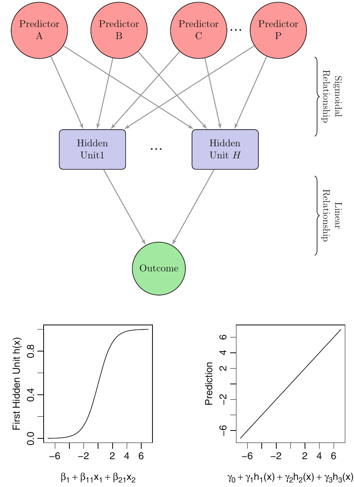

```{r setup, include=FALSE}
knitr::opts_chunk$set(echo = TRUE)
```

You need to install the following packages:

```{r, eval = FALSE}
install.packages(c("e1071"))
```

# Neural Networks

Neural net(work)s are a model that can either be used for regression with continuous outcomes 
(typically with a sum-of-squared errors objective function) or classification of discrete
outcomes (typically with a Bernoulli likelihood). While Partial Least Squares (PLS) constructs
surrogate predictors as linear combinations of primitive predictors to use in a linear model,
neural nets construct surrogate predictors as linear combinations of primitive predictors to
use in a  non-linear model.

$$u_k = \beta_{0k} + \sum_{i=1}^P \beta_{jk} x_j$$
$$g\left(u_k\right) = \frac{1}{1 + e^{-u_k}}$$
$$\eta = \gamma_0 + \sum_{k = 1}^K \gamma_k g\left(u_k\right)$$

and possibly $p = \frac{1}{1 + e^{-\eta}}$ if you need a probability of a binary outcome. The
number $K > 0$ refers to the number of layers in the neural net, and can be tuned by
cross-validation. If $K = 0$, then you basically have a plain GLM.

```{r}

```

As Kuhn and Johnson (2013, 142) says

> A neural network model usually involves multiple hidden units to model the outcome. Note that, unlike the linear combinations in PLS, there are no constraints that help define these linear combinations. Because of this, there is little likelihood that the coefficients in each unit represent some coherent piece of information.

Even more so from Tibshirani, Hastie, and Friedman (2008, 408 -- 409)

> These tools are especially effective in problems with a high signal-to-noise ratio and settings where prediction without interpretation is the goal. They are less effective for problems where the goal is to describe the physical process that generated the data and the roles of individual inputs. Each input enters into the model in many places, in a nonlinear fashion. \dots In general, the difficulty of interpreting these models has limited their use in fields like medicine, where interpretation of the model is very important.

It is often hard to find the global optimum of a very nonlinear model and even if you find it
in the training data, you may discover it overfits the testing data more than some local optimum
in the training data. There are several suggested ways to combat this:

1. Finish early, which is the say do not go all the way to a (local) optimum
2. Use penalization, such as ridge (remember to center and scale predictors)
3. Average the results from several runs

```{r, message=FALSE}
library(ISLR)
library(caret)

set.seed(12345)
in_train <- createDataPartition(College$Outstate, p = 3 / 4, list = FALSE)
training <- College[in_train, ]
testing <- College[-in_train, ]
```

```{r}
nnetGrid <- expand.grid(.decay = c(0, 0.01, .1),
                        .size = c(1:10))
ctrl <- trainControl(method = "cv", number = 10)
nn <- train(Outstate ~ ., data = training, method = "nnet",
            trControl = ctrl, tuneGrid = nnetGrid,
            preProcess = c("center", "scale"), trace = FALSE)
defaultSummary(data.frame(obs = testing$Outstate,
                          pred = predict(nn, newdata = testing)))
```

## Neural Information Processing Systems 2003 Challenge

In 2003, the conference currently known as NeurIPS held a competition to
see who could predict best in the testing data. In these outcomes, the
training data and testing predictors are given to the competitors but
the testing outcomes are withheld until the deadline passes. In 2003,
the focus was on neural nets.

A Bayesian version of a neural net model by Neal and Zhang won and
Neal and Zhang's other entries also finished in the top five or so.
Supervised learning approaches that have a Bayesian rationalization
tend to work well (see BART, although it is not a neural net). We do
not have time to get into why that tends to be the case but some reasons
include

1. Bayesian approaches do not optimize objective functions like most
  supervised learning approaches do and are less prone to overfitting
2. The functions utilized in Bayesian approaches have a grounding in
  probability, unlike most supervised learning techniques
3. Bayesian approaches utilize information that researchers have that
  are not present in the training data to discourage absurd predictions
  in the testing data
  
However, in recent years, people who study neural nets have gone in a
less Bayesian and more machine learning direction in order to apply them
to very large datasets. Whether this is a wise choice or one that has
any bearning on social science research is open to debate.


# Hyperplanes

A subset of a $p$-dimensional space where all of the points satisfy some restriction:
$$\beta_0 + \mathbf{x}^\top \boldsymbol{\beta} = 0$$
If $p = 2$, then this is an equation for a line. If $p = 3$, then this is an equation
for a plane, etc.
```{r}
plot(NA, NA, type = "n", xlim = c(-1.5, 1.5), ylim = c(-1.5,1.5), las = 1,
     xlab = expression("X[1]"), ylab = expression("X[2]"))
abline(a = -1/3, b = -2/3)
```

Let $y$ be coded as $1$ for success and $-1$ (not zero) for failure. A separating
hyperplane is a hyperplane such that
$$y_i \times \left(\beta_0 + \mathbf{x}_i^\top \boldsymbol{\beta}\right) > 0 \forall i$$
A separating hyperplane may not exist, but if it does exist there are an infinite
number of them that can be constructed with slight changes to $\beta_0$ or $\boldsymbol{\beta}$.
The maximal marginal classifier chooses $\beta_0$ and $\boldsymbol{\beta}$ to maximize $M$, such that
$$y_i \times \left(\beta_0 + \mathbf{x}_i^\top \boldsymbol{\beta}\right) \geq M \forall i$$
subject to the additional constraint that 
$\beta_0^2 + \boldsymbol{\beta}^\top \boldsymbol{\beta} = 1$

# Imperfect Classification

A separating hyperplane may not exist in which case there is no maximal marginal classifier.
However, the problem can be relaxed to the choice of $\boldsymbol{\epsilon} \geq \mathbf{0}$, 
$\beta_0$ and $\boldsymbol{\beta}$ to maximize $M$ such that
$$y_i \times \left(\beta_0 + \mathbf{x}_i^\top \boldsymbol{\beta}\right) \geq M\left(1 - \epsilon_i\right) \forall i$$
and $\sum_{i=1}^N{\epsilon_i} \leq C$, where $C$ is a non-negative tuning parameter that
can be chosen by cross-validation. Even if a separating hyperplane does exist, it may be
better to solve the latter problem to avoid overfitting. Given the optimal $\beta_0^\ast$
and $\boldsymbol{\beta}^\ast$, it is easy to classify a training observation based on its
sign when the hyperplane equation is evaluated with an $\mathbf{x}$ from the testing data
to trade off between bias and variance. There are three cases to consider for each 
observation in the training data:

1. $0 = \epsilon_i$ in which case $y_i$ is correctly classified
2. $0 < \epsilon_i < 1$, in which case $y_i$ violates the margin
3. $1 < \epsilon_i$, in which case $y_i$ is on the wrong side of the hyerplane

Observations in category 2 form the _support vectors_.

Can add nonlinear functions, such as polynomials to the columns of $\mathbf{X}$,
although in that case it is even easier to overfit if you do not cross-validate.

# Case with $K$ Categories

There are two main possibilities: Do ${K \choose 2}$ support vector machines in a one-versus-one
scheme or fit $K$ SVMs that have been coded as "in the $k$-th class vs. not in the $k$-th class".

# Comparison with previous approaches

ISLR says on page 365:

> When SVMs were first introduced in the mid-1990s, they made quite a
  splash in the statistical and machine learning communities. This was due
  in part to their good performance, good marketing, and also to the fact
  that the underlying approach seemed both novel and mysterious.

The SVM problem can be re-written as choosing $\beta_0$ and $\boldsymbol{\beta}$
to minimize
$$\sum_{i=1}^N{\max\left[0,1 - y_i \times f\left(\mathbf(x)\right)\right]} + \lambda \sum_{j=1}^p \beta_j^2$$,
which is ridge penalization of the loss function in $\left[\right]$, which is known as hinge loss. 
And hinge loss is very similar to the (negative of) the likelihood function in logistic regression.
So this is basically just ridge-penalized logistic regression where a small (large) value of $\lambda$
corresponds to a small (large) value of $C$. In cases where there is (almost) a separating hyperplane,
SVM can give slightly better results, but in the social sciences logistic regression would seem to be
at least as good.

# Computing SVMs

```{r, SVM, cache = TRUE, message = FALSE}
str(Khan)
colnames(Khan$xtrain) <- paste0("V", 1:ncol(Khan$xtrain))
colnames(Khan$xtest) <- paste0("V", 1:ncol(Khan$xtest))
fit <- train(x = Khan$xtrain, y = Khan$ytrain, method = "svmRadial",
             tuneLength = 14, trControl = ctrl,
             preProcess = c("center", "scale"))
defaultSummary(data.frame(obs = Khan$ytest,
                          pred = predict(fit, newdata = Khan$xtest)))
```

## K Nearest Neighbors

1. Find the $K$ nearest neigbors to observation $i$
2. Use the mean of the outcome among those $K$ observations to predict $y_i$
3. Predict into the training data

This is similar to tree-based methods where each set of $K$ nearest neighbors
is a branch. However, the sets of $K$ nearest neighbors can overlap for different
observations. You can tune $K$

```{r}
fit <- train(Outstate ~ ., data = training, method = "knn",
             tuneControl = ctrl, tuneGrid = data.frame(.k = 1:20))
defaultSummary(data.frame(obs = testing$Outstate,
                          pred = predict(fit, newdata = testing)))
```

# Fairness in Machine Learning

The paper by Mitchell, Potash, and Barocas raises a number of important issues 
concerning fairness in machine learning. It also takes a more causal and more 
frequentist perspective on what machine learners do.

Choices that need to be made:

1. What is the goal?
2. What is the population? (Is there a population?)
3. Specify the set of possible decisions that could be made
4. Specify the outcome you are interested in predicting
5. Assume additivity over individuals
6. Assume away a potential outcome

Then, there are a bunch of things that go into the prediction process
1. Choose a single threshold to classify at
2. Choose predictors
3. Choose how to sample from the population and deal with missing data
4. Identify measurement problems
5. Select a model among the candidates
6. Don't forget about sampling uncertainty

The single threshold approach can be considered optimal (albeit sometimes arbitrary)
only if all of the other choices and assumptions above have been justified. At that
point, you may well worry about classification accuracy in (intersections of) 
subgroups rather than in the overall testing data, which raises many more issues.
A key point is that it is typically impossible to come up with an approach that
satisfies all conceptions of fairness simultaneously, so someone has to choose
which conception of fairness should take precedence.

Their conclusions are basically

1. Conceptually distinguish individuals from the variables they are measured on
2. Don't conflate social bias and (frequentist) statistical bias
3. Accurance is not utility
